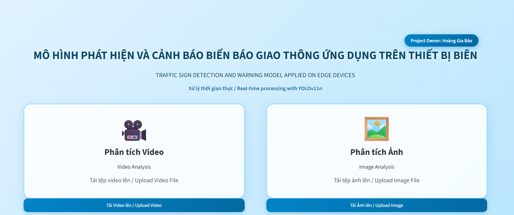

# Vietnamese Traffic Sign Detection and Warning System

<p align="center">
  <strong>Traffic Sign Detection and Warning Model Applied on Edge Devices</strong><br>
  Real-time Vietnamese traffic sign detection using YOLO11n
</p>

<p align="center">
  <a href="https://vietnamese-traffic-sign-detection-and-warning-system-hgb.streamlit.app/">
    <strong>🌐 Live Web Application</strong>
  </a>
</p>

---

## Overview

This project develops a lightweight traffic sign detection and warning system tailored to Vietnamese road environments. The system uses **YOLO11n** to provide a balance between detection accuracy, model size, and inference efficiency, with deployment-oriented evaluation on GPU and mobile devices.

The final application provides a simple **Streamlit web interface for image and video analysis**.

---

## Dataset

The experiments use the **VR-TSD (Vietnamese Road Traffic Sign Dataset)**:

| Property | Value |
|---|---:|
| Traffic-sign classes | **58** |
| Images | **8,078** |
| Annotated bounding boxes | **13,016** |
| Augmented training samples | **2,289** |

The augmentation strategy was designed to improve robustness under challenging Vietnamese traffic conditions, including **nighttime, fog, rain, and motion blur**.

Dataset: <https://universe.roboflow.com/vietnam-traffic-sign-recognition-benchmark/vr-tsd>

---

## Model

The project evaluated multiple lightweight YOLO variants and selected **YOLO11n** as the final model because of its favorable balance between accuracy and computational efficiency.

| Configuration | Value |
|---|---:|
| Model | **YOLO11n** |
| Task | Object Detection |
| Training image size | **768 × 768** |
| Batch size | **64** |
| Optimizer | **AdamW** |
| Maximum epochs | **250** |
| Early stopping patience | **40** |
| Initial learning rate | **0.0005** |
| Model size | **5.54 MB** |

After training, confidence thresholds were optimized **per class** on the validation set to maximize F1-score.

---

## Results

The final YOLO11n model achieved:

| Metric | Result |
|---|---:|
| Precision | **0.9397** |
| Recall | **0.9262** |
| Macro F1 @ IoU = 0.5 | **0.9295** |
| mAP@0.5 | **0.9605** |
| mAP@0.5:0.95 | **0.8022** |
| Model size | **5.54 MB** |

### Inference Benchmark

| Device | FPS |
|---|---:|
| NVIDIA A100 | **180.51** |
| Google Pixel 5 | **17.24** |
| Samsung Galaxy S23 | **78.74** |

The reported FPS values are model-inference benchmarks and are therefore different from the end-to-end processing speed of a complete web application.

---

## Web Application

The deployed web interface is built with **Streamlit** and currently provides two analysis modes:

- **Image Analysis** — upload `.jpg`, `.jpeg`, or `.png` images.
- **Video Analysis** — upload `.mp4`, `.avi`, or `.mov` videos.

The application displays detected traffic signs and provides corresponding warning feedback.

### Interface

<p align="center">
  
</p>

### Live Demo

**Web application:**  
https://vietnamese-traffic-sign-detection-and-warning-system-hgb.streamlit.app/

---

## Run Locally

```bash
git clone https://github.com/HoangGiaBao107/Vietnamese-Traffic-Sign-Detection-and-Warning-System.git
cd Vietnamese-Traffic-Sign-Detection-and-Warning-System
pip install -r requirements.txt
streamlit run APP.py
```

---

## Project Structure

```text
Vietnamese-Traffic-Sign-Detection-and-Warning-System/
│
├── APP.py
├── detector.py
├── utils.py
├── best.onnx
├── requirements.txt
├── Warning_sound/
├── web_interface.png
└── README.md
```

---

## Links

- **GitHub:** https://github.com/HoangGiaBao107/Vietnamese-Traffic-Sign-Detection-and-Warning-System
- **Web Application:** https://vietnamese-traffic-sign-detection-and-warning-system-hgb.streamlit.app/
- **Dataset:** https://universe.roboflow.com/vietnam-traffic-sign-recognition-benchmark/vr-tsd
