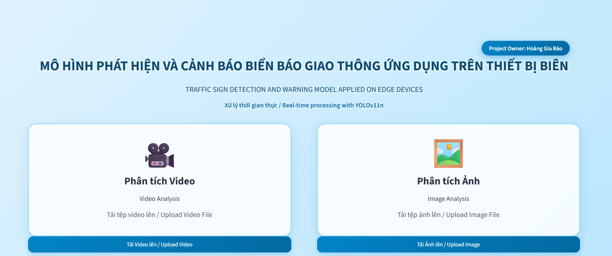

# Vietnamese Traffic Sign Detection and Warning System

<p align="center">
  <strong>Traffic Sign Detection and Warning Model Applied on Edge Devices</strong><br>
  Real-time Vietnamese traffic sign detection using YOLO11n
</p>

<p align="center">
  <a href="https://vietnamese-traffic-sign-detection-and-warning-system-hgb.streamlit.app/">
    <strong>🌐 Live Web Application</strong>
  </a>
</p>

---

## Overview

This project develops a lightweight traffic sign detection and warning system tailored to Vietnamese road environments. The system uses **YOLO11n** to provide a balance between detection accuracy, model size, and inference efficiency, with deployment-oriented evaluation on GPU and mobile devices.

Beyond training the detector, this version hardens the data pipeline itself: a two-stage filename- and perceptual-hash screening process removes train/validation/test duplication, a data-driven taxonomy refinement prunes classes that were too under-represented to learn reliably, and robustness is validated on two offline, hand-tuned stress-test domains (fog and rain) rather than on the clean test set alone.

The final application provides a simple **Streamlit web interface for image and video analysis**.

---

## Dataset

The experiments use the **VR-TSD (Vietnamese Road Traffic Sign Dataset)**:

| Property | Value |
|---|---:|
| Traffic-sign classes (original / used) | 58 / **53** |
| Images | **8,078** |
| Annotated bounding boxes (original taxonomy) | **13,016** |
| Rare/hard-class augmented training samples | **1,933** |

Five classes with persistently insufficient instance counts (too few to learn reliably, and actively harmful to end-user accuracy if kept) were pruned from the taxonomy, leaving 53 classes. The validation/test pool was also rebuilt with a filename- and perceptual-hash duplicate screen, so no near-duplicate frame can appear on both the training set and the pool, or straddle the validation/test split.

Training-time augmentation (bounding-box-aware shift/scale/rotate, brightness/contrast, HSV, Gaussian blur) is applied only to selectively multiply the remaining rare and historically difficult classes — no weather effects are injected during training. Robustness is instead measured **post-hoc** on two offline stress-test domains built only from the held-out test images: a procedural **fog/haze** domain and a physically based **windshield-raindrop rendering** domain (refraction, Fresnel highlights, gravity-fed rivulets), both hand-tuned against the target thresholds mAP@0.5 ≥ 85% and Macro F1 ≥ 75%.

Dataset: <https://universe.roboflow.com/vietnam-traffic-sign-recognition-benchmark/vr-tsd>

---

## Model

YOLO11n is used for its favorable balance between accuracy, model size, and inference speed, making it well suited to edge deployment.

| Configuration | Value |
|---|---:|
| Model | **YOLO11n** |
| Task | Object Detection |
| Training image size | **896 × 896** |
| Batch size | **64** |
| Optimizer | **AdamW** |
| Maximum epochs | **200** |
| Early stopping patience | **35** |
| Initial learning rate | **0.0020** |
| Model size | **5.3 MB** (PyTorch) / 10.3 MB (ONNX) |

After training, confidence thresholds were optimized **per class** on the validation set to maximize F1-score (classes with fewer than 15 validation instances keep the default 0.25 threshold).

---

## Results

### Clean test set (53 classes)

| Metric | Result |
|---|---:|
| Precision | **87.36%** |
| Recall | **89.11%** |
| Macro F1 @ IoU = 0.5 | **87.29%** |
| mAP@0.5 | **96.04%** |
| mAP@0.5:0.95 | **81.97%** |
| Model size | **5.3 MB** |

### Robustness — offline stress-test domains

| Domain | mAP@0.5 | Macro F1 |
|---|---:|---:|
| Fog | **90.72%** | **75.84%** |
| Rain | **90.81%** | **77.07%** |

Both domains clear the predefined robustness targets (mAP@0.5 ≥ 85%, Macro F1 ≥ 75%).

### Inference Benchmark

| Device | ms / image | FPS |
|---|---:|---:|
| NVIDIA T4 ×2 (Kaggle) | 5.78 | **173.01** |
| Google Pixel 5 | 58.0 | **17.24** |
| Samsung Galaxy S23 | 12.7 | **78.74** |

The reported FPS values are model-inference benchmarks and are therefore different from the end-to-end processing speed of a complete web application.

---

## Web Application

The deployed web interface is built with **Streamlit** and currently provides two analysis modes:

- **Image Analysis** — upload `.jpg`, `.jpeg`, or `.png` images.
- **Video Analysis** — upload `.mp4`, `.avi`, or `.mov` videos.

The application displays detected traffic signs and provides corresponding warning feedback.

### Interface

<p align="center">
  
</p>

### Live Demo

**Web application:**  
https://vietnamese-traffic-sign-detection-and-warning-system-hgb.streamlit.app/

---

## Run Locally

```bash
git clone https://github.com/HoangGiaBao107/Vietnamese-Traffic-Sign-Detection-and-Warning-System.git
cd Vietnamese-Traffic-Sign-Detection-and-Warning-System
pip install -r requirements.txt
streamlit run APP.py
```

---

## Project Structure

```text
Vietnamese-Traffic-Sign-Detection-and-Warning-System/
│
├── APP.py
├── detector.py
├── utils.py
├── best.onnx
├── requirements.txt
├── Warning_sound/
├── web_interface.png
└── README.md
```

---

## Links

- **GitHub:** https://github.com/HoangGiaBao107/Vietnamese-Traffic-Sign-Detection-and-Warning-System
- **Web Application:** https://vietnamese-traffic-sign-detection-and-warning-system-hgb.streamlit.app/
- **Dataset:** https://universe.roboflow.com/vietnam-traffic-sign-recognition-benchmark/vr-tsd
